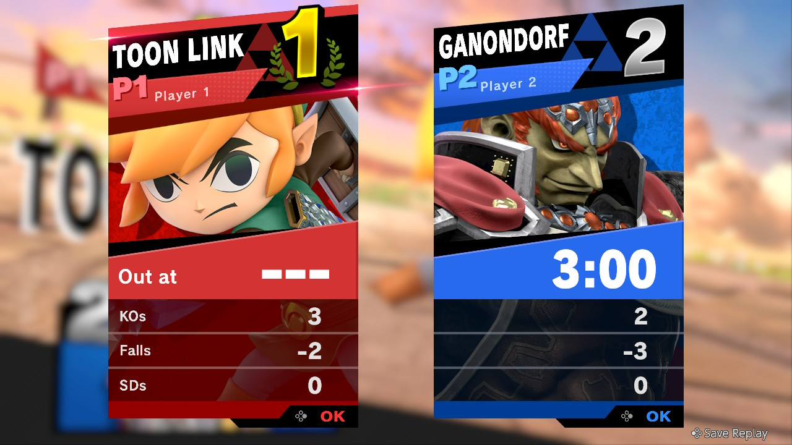
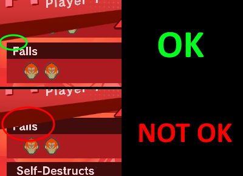
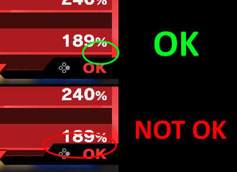

### Warnings
I've tested the script only on Windows. It should also run on Linux. No idea if it runs on Mac.  
The script currently doesn't support the following character(s):
- Sephiroth

It COULD support those characters, but I need some screenshots in order to add a face reference for the character recognition. If you're interested in using this program with those characters, you can send me those screenshots and I'll do the rest! More info below.

# SmashDataCollector
SmashDataCollector is a Python script that takes in input screenshots from the result screen of a Super Smash Bros. Ultimate match, extrapolates the stats and saves them in a spreadsheet (see examples in the last paragraph of the "How to use it" section). These stats can be then analized as with any spreadsheet and produce interesting and beautiful plots. Who doesn't love plots c'mon.  
This started as a small project made to save some time to me and my roommate and extrapolates the stats automatically instead of manually adding them to the spreadsheet, and I then decided to make it work with every language and multple match setups jsut for the sake of it.  
If you too are an occasional Smash player and a stats nerd, this is for you!

## Features
- For every match and for every player of the match, the script automatically collects the following stats: position, time survived, falls (as in who killed you, including selfdestructions), given damage and taken damage. It does not collect the kills of a player because from the falls you can reconstruct the kills.
- **The script supports ALL the available languages** in Super Smash Bros. Ultimate as up to v10.1.0 (which are Japanese, English, French, Spanish, German, Italian, Dutch, Russian, Chinese (traditional), Chinese (simplified) and Korean), with automatic language recognition.
- **The script supports matches with 2, 3 and 4 players.**
- **The script supports matches with both actual players and CPU.**

## How to use it
First, download the script. You CAN download the whole repository, but I'd suggest to download the latest release (whcih you can find [here](https://github.com/Fran314/SmashDataCollector/releases)), as it has only the stuff that you need to run the script and not the bunch of stuff that I needed and need to make the character faces database.
### What to do when you're Smashing
In order to save a match for collecting the data later, you'll have to take two screenshots (using the screenshot button on the Switch, and not any other screenshot function that your monitor/television might have) for every match you play. In particular, you'll have to take a screenshot of the result screen where the "Out at" time is displayed (and we'll call it first screenshot), and a screenshot of the result screen where the kills, falls, damage taken and damage given are displayed. An example of what the first and second screenshot should look like is this:  

  
Taking the first screenshot is just pressing the screenshot button, it's as easy as it gets.  
For the second screenshot you have to be a bit more precise, because the menu is a scrolling menu and not all the necessary stats are displayed before scrolling the menu. When you take the second screenshot you have to make sure that the scroll menu is not too high (which means the left side of the "Falls" row should be fully visible) and not too low (the right side of the "Taken damage" row should be fully visible). It is a bit annoying to have to check out for this, but the range of positions for the scroll menu for it to be a valid screenshot is very wide, so it's not as annoying as it sounds.  
Here's examples of valid and invalid positions of the scroll menu:  

  
After these two screenshot you can go for the next match. That's all it takes, and once you get used to it, it really just takes you away a couple of seconds per match!

### How to transfer the screenshots
Once you've decided that you want to analyze the matches you've played, you have to move the screenshots from the Switch to your computer. As of version 11.0.1 of the Switch OS, the easiest way to do so is to connect your Switch to your computer with a USB-C cable, and then go to "System Settings" > "Data Management" > "Manage Screenshots and Videos" > "Copy to a Computer via USB Connection". I guess you could also move them to the SD Card and then from that to the computer, but I've never tested it.  
What you HAVE to make sure is that the screenshots are the ones directly taken from the Switch, and make sure they are 1280x720px in resolution. Any other size would just completely mess up the data display position and would not work with the image references from the database. Also, do not rename the screenshots.

### How to collect the stats from the screenshots
Once you've got the screenshots on your computer, you're ready to collect the stats. If you don't have a Python script interpreter installed on your computer, this is the time to do so. There's plenty of guides on how to do so on the internet, just pick one and go.  
Now that you're ready to run the Python script, you first have to "customize the customizables". The customizeables are variables which you have to modify yourself to make the script work on your specific case. You can find them in the file "customizable.py". Open it with your preferred text editor (if you're new to Python DON'T double click the file, as it would just execute the script. Instead, right click and open it with Notepad or any other text editor) and customize the customizables: 
- Set the "DATA_PATH" to the absolute path of the folder where you saved the screenshots. Make sure that in that folder you ONLY have the screenshots and nothing else. From now on I'll call these screenshots the "matches batch".
- Set the "RES_PATH" to the absolute path of the folder called "res" that came with the project latest release
- Set the "OUTPUT_PATH" to the absolute path of the file where you want to save the data. The name of the file should be included. The data is saved with the ".tsv" format (tab separated values) but you can save it as a normal ".txt" too. The reason why the data is saved with the ".tsv" format is that then you can just open it with a normal text editor, Ctrl+C the content of the file and Ctrl+V it in a spreadsheet. I've tested it only on Google spreadsheet but I believe it should work on Excel too. If Google and Microsoft use different formats for copypasting data then this world is pure madness and there is no point in doing anything.
- Set the "LIVES" to the number of lives that each player has for the match. As explained in the "Restrictions" section, all the matches must be stocks matches and not time matches
- You can but don't have to change the "TAKEN_GIVEN_DMG_THRESHOLD" variable. What does is set a threshold for the difference of the sum of all the taken damage and all the given damage. Those two numbers usually don't coincide because players get damage when they're too far from the stage, but too big of a difference might mean that the script didn't read those values correctly. 35 is a value that I found to be big enough to have very little false positives when error checking, but small enough to actually find the errors. It should be noted that the script will almost surely flag for this error in a match where Ice Climbers is played, because its taken damage displays the damage taken only from the main ice climber, but given damage of other players includes the damage given to the other ice climber too.

Now that you've customized the customizables, you're ready to run the script. Just doubleclick on SmashDataCollector.py and let it do its magic. Beware that it will take some time. On my laptop, it takes roughly 6 seconds to collect the data from one match, so just do the math for your case. In any case, I'd suggest to keep the number of matches to analize low, maybe not more than 50 at a time. No real reason to it but to keep the elapsed time low.

### Problematic matches
After the script did its thing, it will give you a list of the problematic matches. The problematic matches are the matches that for some reason caused issues when trying to extrapolate the data (maybe had some issues when trying to find the anchor point for the scroll menu, or as with the Ice Climber case, the difference between the taken and given damage was too big and the script suspected that there was a mistake in reading the data). Do not worry as this could and will happen, as the script is not perfect. What will happen now is that you'll get prompts from the terminal to manually input the data yourself. For every problematic match you'll be shown the screenshots from the match and you'll be prompted to write the data manuall in the terminal. Just do what the terminal asks you to do and you'll be fine (this is not, in fact, a threat.)

### What now?
If everything went according to plans, you should now have your desired output! You can now Ctrl+C Ctrl+V the data from the output file to any spreadsheet you want. [Here](https://docs.google.com/spreadsheets/d/1xbwun7a1vsP3P2eTPFk6MIKKevnX_Mfcridpy4F3Qms/edit?usp=sharing)'s a demo of the spreadsheet that I personally use to save and analyze the data. The demo spreadsheet currently has the data from the /data/demo folder that you'll find in the release. This data won't look like the data you'll collect yourself as those are only some quick matches that I played to show that the script works with every language, and not actual "competitive" matches. Feel free to customize the spreadsheet as needed!

## Restrictions
- **The script does not do skin recognition** (as in, you CAN use any skin you won't, but the script won't check which one you used, and will only check for which character you used). This means that any game with the same character played by two different players will give unreliable results, and would likely have to be manually added after the script ends. The problem is that instead of actually seeing that the match is unreadable and adding it to the problematic matches (to be manually added after the script), it might try to read it anyway and not flag it as problematic, giving unreliable results. I'm planning on adding a check that automatically adds the match to the problematic matches if the same character is used more than once, to avoid unreliable results. I am NOT planning on adding skin recognition as the only way to do it is having to make a third screenshot which would be actually pointless in most of the cases. The issue that I don't know how to solve is that for some characters, the skin used is mostly unrecogniseable from the first screenshot, which is the one used for character recognition.

- **The matches have to be stock matches and not time matches.** The script MIGHT work for time matches, too, but I haven't tested it as me and my roommates only play stock matches

- **The number of lives per player must be less than 8** (for 4 players) **or 10** (for 2 and 3 players). The thing is, if you die more than 10 times (or 8 for 4 players) the falls icons get displayed in two rows instead of one, which messes up the display position of all the other stats.

- **The matches cannot be 2v2.** Even though you can play with 4 playes, I have not tested how the result screen looks on 2v2. It might just work, but I can only guarantee for 1v1v1v1 if you play with 4 players.

- **The time for a match must not exceed 59:59.** Though if you actually succeed in a 1h match, congrats.

## Credits
Thanks to u/Lukaskywalkr on reddit for providing most of the screenshots for the DLC characters

## Adding characters not currently supported
The script currently doesn't support some of the DLC characters. This is because I personally don't own the DLCs and I don't have those characters. To be able to support those characters I need to have the cutout of their face from their artwork in the database. What I'm missing is the reference in order to know the position and scaling of the cutout. If you have any of the characters missing and you want to be able to recognize it with the script, I'll need you to send me some screenshots. In particular, you have to send me a "first screenshot" (see second paragraph of the "How to use it" section to understand what I mean with "first screenshot") of two matches: one where there are 3 players, and one where there are 4 players. If possible, the character to add should NOT be in first place. Just send me the screenshots and I'll do the rest!

## General info
The script works with Super Smash Bros. Ultimate v10.1.0 (which is the latest version available as I'm writing this). This script relies on knowing precisely where certain data is displayed in the screenshot. Because of this, the script might not work if they change the graphics of the screen results in later versions. I don't think they will, but there's no real reason not to do it. So if you're using a newer version and you notice that the script doesn't work, that's likely why. If you notice it, contact me and I'll try to fix it if I can!
